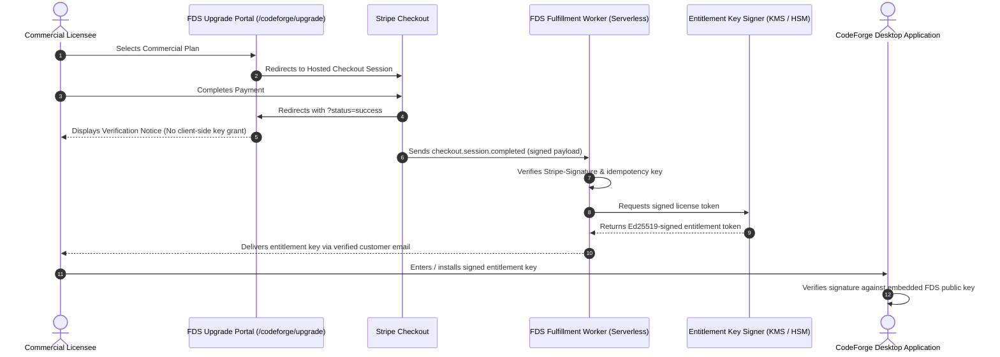

# CodeForge Commerce & Desktop Entitlement Architecture Specification

## 1. System Overview & Security Posture

CodeForge employs a **free-first, local-capable engineering architecture**. The core software distribution is freely downloadable via GitHub Releases and the FDS Forged portal.

For commercial licensing and priority enterprise capabilities, CodeForge uses a **fail-closed, cryptographically signed entitlement boundary**.

> [!IMPORTANT]
> **Static Web Surface Trust Boundary**:
> The static FDS website (`forger-digital-solutions.github.io`) is an untrusted presentation layer.
> - The website **NEVER** processes credit cards directly.
> - The website **NEVER** issues entitlement keys or updates client licensing state.
> - Client-side checks in the browser or portal UI are purely visual/UX affordances. Real authority exists strictly in serverless webhook handlers and offline cryptographic signature validation.

---

## 2. Server-Side Webhook & Fulfillment Contract

When commercial checkout is activated via Stripe or a merchant of record, fulfillment follows a strict asynchronous pipeline:



### A. Webhook Verification Requirements
1. **Signature Validation**: Every incoming webhook must verify the `Stripe-Signature` header against the secret key (`whsec_...`) using HMAC-SHA256.
2. **Idempotency**: Webhook events are tracked by `event.id` in durable storage (e.g. Cloudflare D1 or DynamoDB). Duplicate events are acknowledged with HTTP 200 without duplicate key generation.
3. **Fail-Closed Processing**: Unrecognized events, signature mismatches, or malformed payloads return HTTP 400/403 and terminate immediately.

---

## 3. Cryptographically Signed Desktop Entitlement Schema

CodeForge desktop applications do NOT rely on constant phone-home telemetry or fragile online DRM. Instead, entitlements are portable, cryptographically signed JSON Web Tokens (JWT) or CBOR Web Tokens (CWT) signed by the FDS offline private key (Ed25519).

### Schema Specification (`fds-codeforge-entitlement-v1`)

```json
{
  "$schema": "https://forgerdigitalsolutions.com/schemas/codeforge-entitlement-v1.json",
  "schema_version": "1.0",
  "entitlement_id": "ent_01hx7a9f82k3m4n5p6q7r8s9t0",
  "issued_at": 1741478400,
  "not_before": 1741478400,
  "expires_at": 1773014400,
  "licensee": {
    "customer_id": "cus_N9v8x7L2k1",
    "organization": "Acme Engineering Labs",
    "email": "lead-engineer@acme.example"
  },
  "product": {
    "name": "codeforge",
    "tier": "pro",
    "version_range": ">=0.2.0 <2.0.0"
  },
  "seats": {
    "authorized_workstations": 2,
    "concurrency_limit": 4
  },
  "features": [
    "multi_engine_routing",
    "priority_batch_tasks",
    "commercial_distribution_rights",
    "custom_styleguide_enforcement"
  ],
  "offline_grace_period_days": 30,
  "issuer": "Forger Digital Solutions Licensing Authority",
  "signature_algorithm": "Ed25519"
}
```

### Verification Rules on Desktop Client:
1. **Public Key Pinning**: CodeForge desktop bundles the FDS public signing key directly in its binary.
2. **Clock Tamper Protection**: Compares `issued_at` and `expires_at` against local monotonic clocks and recent repository commit timestamps.
3. **Fail-Closed Fallback**: If signature verification fails, the token is expired, or the file is missing/tampered, CodeForge logs the warning and immediately defaults to **CodeForge Free** (ForgeZero zero-cost mode). It **never crashes** or destroys user work.

---

## 4. Current Portal Implementation (`/codeforge/upgrade`)

- **Routing Status**: Unlisted route excluded from navigation headers and sitemaps.
- **Search Engine Directives**: Rendered with `<meta name="robots" content="noindex, nofollow" />`.
- **Pricing Display**: Free Tier ($0, active). Commercial tiers show **"Not yet published"**; provisional values are withheld to prevent misrepresentation.
- **Checkout Guard**: Clicking commercial preview triggers an informative verification dialog explaining that commercial checkout is currently undergoing private testing and will launch alongside certified desktop release binaries.
- **Redirect Handlers**:
  - `?status=success`: Displays clear notice that payment has been received and fulfillment will arrive via verified email after backend confirmation (preventing client-side self-granting).
  - `?status=canceled`: Displays neutral cancellation state with link to return to free downloads or support.
